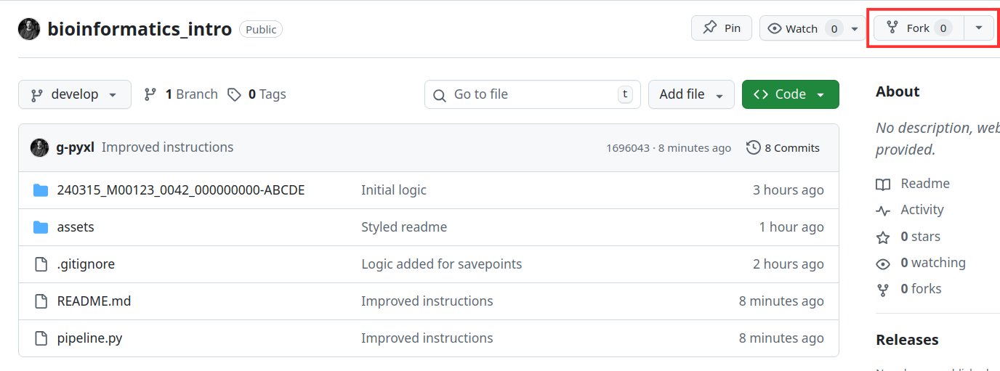
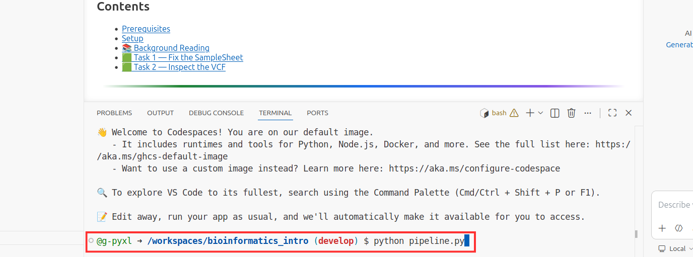

<p align="center">
  
</p>

<p align="center">
  <strong>Lesson 1 — GitHub Basics</strong><br/>
  Learn the Git workflow used every day by clinical bioinformatics teams.
</p>

<p align="center">
  
</p>

## Learning Objectives

By the end of this lesson you will be able to:

- Fork a GitHub repository
- Create a branch for your changes
- Find and fix a bug in a Python script
- Commit your changes with a meaningful message
- Open a Pull Request

<p align="center">
  
</p>

## Background

<details>
<summary><strong>What is Git?</strong></summary>

<br>

**Git** is a version control system — software that tracks every change made to a set of files over time. Think of it as an unlimited undo history for your entire codebase, with the added benefit that you can see exactly who changed what, when, and why.

Key concepts:

| Term | Meaning |
|---|---|
| **Repository (repo)** | A folder whose entire history is tracked by Git. |
| **Commit** | A saved snapshot of your changes, along with a message describing what you did. |
| **Branch** | An isolated copy of the code where you can make changes without affecting the main version. |
| **Merge** | Bringing changes from one branch into another. |

</details>

<details>
<summary><strong>What is GitHub?</strong></summary>

<br>

**GitHub** is a web platform that hosts Git repositories and adds collaboration features on top. In a clinical bioinformatics team it is used to:

| Use | Why it matters |
|---|---|
| Store pipeline code | Every version of the pipeline is preserved and can be reproduced exactly. |
| Review changes | Before new code affects patient results, it is reviewed by a colleague via a Pull Request. |
| Track issues | Bugs and feature requests are logged as GitHub Issues, keeping work organised and auditable. |
| Automate checks | Automated tests run on every change (CI/CD), catching problems before they reach production. |

</details>

<details>
<summary><strong>What is a Fork?</strong></summary>

<br>

A **fork** is your own personal copy of someone else's repository. When you fork a repo, GitHub creates an identical copy under your account. You can make any changes you like to your fork without affecting the original.

This is the standard workflow for contributing to a shared codebase:

```
Original repo (owned by someone else)
        │
        ▼
   Your fork  ◄──── you work here
        │
        ▼
 Pull Request  ◄──── you ask to merge your changes back
        │
        ▼
 Original repo (if accepted)
```

</details>

<details>
<summary><strong>What is a Pull Request?</strong></summary>

<br>

A **Pull Request (PR)** is a proposal to merge changes from one branch (or fork) into another. It opens a discussion thread where collaborators can:

- Review your code line by line
- Leave comments and suggestions
- Approve or request further changes before merging

In clinical bioinformatics, the PR review step is essential — it ensures that no change reaches a validated pipeline without a second pair of eyes.

</details>

<details>
<summary><strong>What is GC content?</strong></summary>

<br>

**GC content** is the percentage of bases in a DNA sequence that are either Guanine (G) or Cytosine (C).

```
Formula:  GC content (%) = (G + C) / total bases × 100
```

Example — the sequence `ATGCATGC` has 8 bases, of which 4 are G or C:

```
GC content = 4 / 8 × 100 = 50%
```

GC content matters because:
- It affects the melting temperature of DNA (higher GC → higher Tm)
- Genomic regions vary in GC content, which can affect sequencing quality
- Some sequencing technologies produce fewer reads in very high or very low GC regions

</details>

<p align="center">
  
</p>

## Your Task

There is a bug in [`gc_content.py`](gc_content.py). The script is supposed to calculate the GC content of DNA sequences, but it produces wrong answers — and for some sequences it crashes entirely.

Your job is to:

1. Fork this repository
2. Create a branch
3. Find and fix the bug
4. Commit your fix
5. Open a Pull Request

<p align="center">
  
</p>

## Step-by-Step Instructions

### Step 1 — Fork the repository

Click the **Fork** button in the top-right corner of the original repository page, then click **Create Fork**.

| Fork screenshot |
|---|
|  |

This creates your own copy at `https://github.com/<your-username>/bioinformatics_intro`.

---

### Step 2 — Open a Codespace

On your forked repo, click the green **Code** button, select the **Codespaces** tab, and click **Create codespace on main**.

| Codespace screenshot |
|---|
|  |

Wait for the Codespace to finish loading — you will see a terminal at the bottom of the screen.

---

### Step 3 — Create a branch

In the Codespace terminal, create a new branch for your fix:

```bash
git checkout -b fix/gc-content-bug
```

> **Why a branch?** Branches let you isolate your work. If something goes wrong, `main` is unaffected. In clinical bioinformatics, no one ever commits directly to `main` — changes always go through a branch and a Pull Request.

---

### Step 4 — Reproduce the bug

Run the script to see the failing tests:

```bash
python lessons/01_github_basics/gc_content.py
```

You should see output like this:

```
GC Content Calculator
============================================================

Sequence         Expected        Got  Result                Notes
---------------------------------------------------------------------------
ATGCATGC            50.0%     100.0%  FAIL                  Alternating AT and GC
GGGGAAAA            50.0%     100.0%  FAIL                  4× G + 4× A
ATCGATCG            50.0%     100.0%  FAIL                  Typical coding sequence
GCGCGCGC           100.0%      ERROR  ZeroDivisionError     All GC
ATATATATAT           0.0%       0.0%  PASS                  All AT
```

The script is broken. Read the output carefully — what is the pattern? The all-AT case passes, but everything else is wrong or crashes.

---

### Step 5 — Find the bug

Open [`gc_content.py`](gc_content.py) in the editor. Read through the `calculate_gc_content()` function.

Compare the code to the GC content formula in the background reading:

```
GC content (%) = (G + C) / total bases × 100
```

<details>
<summary><strong>Hint</strong></summary>

<br>

Look at the denominator of the division in `calculate_gc_content()`. What is it dividing by? Is that the same as "total bases"?

</details>

<details>
<summary><strong>Reveal the fix</strong></summary>

<br>

The bug is on this line:

```python
gc_content = (g_count + c_count) / (a_count + t_count) * 100
```

It divides by the AT count instead of the total number of bases. Fix it:

```python
gc_content = (g_count + c_count) / len(sequence) * 100
```

For `GCGCGCGC`, the AT count is zero — hence the `ZeroDivisionError`. For all other sequences, the result is inflated because the denominator is too small.

</details>

---

### Step 6 — Verify your fix

After making the change, run the script again:

```bash
python lessons/01_github_basics/gc_content.py
```

All five tests should now show `PASS`.

---

### Step 7 — Commit your change

Stage the file you edited and write a clear commit message:

```bash
git add lessons/01_github_basics/gc_content.py
git commit -m "fix: divide by total bases not AT count in calculate_gc_content"
```

> **Commit message tips:**
> - Use the imperative mood: "fix bug" not "fixed bug"
> - Be specific about *what* you changed and *why*
> - In clinical bioinformatics, commit messages form part of the audit trail for validated software

---

### Step 8 — Push your branch

```bash
git push origin fix/gc-content-bug
```

---

### Step 9 — Open a Pull Request

1. Go to your fork on GitHub (`https://github.com/<your-username>/bioinformatics_intro`)
2. You should see a banner: **"fix/gc-content-bug had recent pushes"** — click **Compare & pull request**
3. Make sure the **base repository** is the original repo (not your fork) and the **base branch** is `main`
4. Write a short description of the bug you found and how you fixed it
5. Click **Create pull request**

That's it! The Pull Request will notify the repository maintainer for review.

<p align="center">
  
</p>

## Summary

You have practised the core GitHub workflow used in clinical bioinformatics:

```
Fork → Branch → Fix → Commit → Push → Pull Request
```

This cycle — sometimes called the **feature branch workflow** — ensures that every change is isolated, reviewed, and traceable before it reaches a shared codebase.

## Knowledge Check

Test your understanding with the short quiz before moving on:

**[→ Take the Lesson 1 Quiz](https://g-pyxl.github.io/bioinformatics_intro/)**

[← Back to lessons](../../README.md)
