<p align="center">
  
</p>

<p align="center">
  <strong>Lesson 2 — NGS Pipeline</strong><br/>
  Work through a real clinical bioinformatics pipeline: fix a SampleSheet, run demultiplexing, and interpret variant calls.
</p>

<p align="center">
  
</p>

## Prerequisites

Complete [Lesson 1 — GitHub Basics](../01_github_basics/README.md) first.

<p align="center">
  
</p>

## Getting Started

This lesson is driven by an interactive script. From the repository root, run:

```bash
python pipeline.py
```

Then follow the on-screen prompts and return to this page for the task instructions below.

> **Assessment coordinators:** you can send checkpoint events to an external webhook:
>
> ```bash
> export PIPELINE_CHECKPOINT_WEBHOOK="https://your-service.example/webhook"
> export PIPELINE_CHECKPOINT_TOKEN="your-shared-token"
> python pipeline.py
> ```
>
> To reset progress at any time:
>
> ```bash
> python reset.py
> ```

<p align="center">
  
</p>

## 📚 Background Reading

<details>
<summary><strong>Next Generation Sequencing (NGS)</strong></summary>

<br>

**Next Generation Sequencing (NGS)** is a group of high-throughput methods that can sequence millions of DNA fragments in parallel. Compared with older single-fragment methods (such as Sanger sequencing), NGS produces much more data per run and enables broad tests such as gene panels, exomes, genomes, and targeted amplicon assays.

#### Typical NGS workflow

| Stage | What happens |
|---|---|
| Sample preparation | DNA (or RNA converted to cDNA) is extracted from the specimen and converted into a sequencing library by adding adapters and, where needed, sample indexes (barcodes). |
| Sequencing run | Library fragments bind to a flow cell and are sequenced cycle-by-cycle. The instrument captures signals and converts them into base calls with quality scores. |
| Primary analysis | Raw instrument output is converted into FASTQ files, then demultiplexed into one file pair per sample if multiple samples were pooled. |
| Secondary analysis | Reads are aligned to a reference genome and analysed for variants (SNVs, indels, CNVs, etc.), depending on the test design. |
| Interpretation & reporting | Detected variants are filtered, annotated, and interpreted in a clinical context before a report is issued. |

#### Core terms

| Term | Meaning |
|---|---|
| Read | One sequenced DNA fragment (or one end of a fragment in paired-end sequencing). |
| Paired-end sequencing | Sequencing both ends of the same DNA fragment, improving alignment and structural resolution. |
| Coverage (depth) | How many times a base is sequenced; higher coverage usually increases confidence in variant calls. |
| Q score | A Phred quality score representing confidence in each base call (e.g. Q30 means 1 in 1000 error probability). |

</details>

<details>
<summary><strong>FASTQ Files</strong></summary>

<br>

A **FASTQ** file stores sequencing reads along with per-base quality scores. It is the standard output format after demultiplexing.

Each read is represented by **4 lines**:

| Line | Contents |
|---|---|
| 1 | Read header (starts with `@`) |
| 2 | Nucleotide sequence (`A/C/G/T/N`) |
| 3 | Separator line (starts with `+`) |
| 4 | Quality string (ASCII-encoded Phred quality scores) |

In **paired-end** sequencing, each sample usually has two FASTQ files:

| File | Meaning |
|---|---|
| `R1` | Forward read (read 1) |
| `R2` | Reverse read (read 2) |

FASTQ files are often compressed as `.fastq.gz` because they are large.

</details>

<details>
<summary><strong>The Illumina Run Folder</strong></summary>

<br>

This repository contains a folder called `240315_M00123_0042_000000000-ABCDE`. This is a simulated **Illumina run folder** — the directory structure written to disk by an Illumina sequencing instrument when a sequencing run completes.

The folder name follows a standard Illumina convention:

```
240315_M00123_0042_000000000-ABCDE
│      │       │    └─ Flow cell ID
│      │       └─ Run number
│      └─ Instrument serial number
└─ Date (YYMMDD)
```

#### Files in the run folder

| File / Folder | Purpose |
|---|---|
| `RTAComplete.txt` | Written by the instrument's **Real-Time Analysis (RTA)** software when base-calling has finished. Its presence signals to downstream software that the run is ready to process. |
| `RunInfo.xml` | Machine-readable metadata about the run: instrument ID, flow cell ID, number of reads (cycles), and lane/tile layout. |
| `SampleSheet.csv` | Tells demultiplexing software which samples were on the run, which index sequences they used, and how output files should be named and organised. |
| `InterOp/` | Binary files written by the instrument containing real-time quality metrics. |
| `Data/Intensities/BaseCalls/` | Where the instrument writes the raw FASTQ files — one pair per sample per lane. |

#### What is a SampleSheet?

The `SampleSheet.csv` is a plain-text file in CSV format with several sections:

| Section | Contents |
|---|---|
| `[Header]` | Run-level metadata: experiment name, date, instrument type, chemistry. |
| `[Reads]` | The number of cycles sequenced per read (e.g. `151` means 151 base pairs). |
| `[Settings]` | Software settings such as adapter trimming sequences. |
| `[Data]` | The sample table — one row per sample, with columns for ID, name, index sequences, and project. |

SampleSheet errors are a common cause of pipeline failures. A single typo in a sample ID or index sequence can cause an entire run's worth of data to fail demultiplexing.

</details>

<p align="center">
  
</p>

## 🟩 Task 1 — Fix the SampleSheet

The `SampleSheet.csv` in the run folder contains a deliberate error — the kind of mistake that is easy to make and quick to miss.

<details>
<summary><strong>Show instructions</strong></summary>

<br>

**Step 1** — Open the SampleSheet in the editor:

```
240315_M00123_0042_000000000-ABCDE/SampleSheet.csv
```

Navigate to the `[Data]` section at the bottom. Look carefully at the `Sample_ID` column.

---

**Step 2** — Fix the invalid sample ID:

> **Hint:** Illumina sample IDs must not contain spaces. Replace any space with an underscore (`_`).

---

**Step 3** — Save the file and re-run `python pipeline.py` to validate.

</details>

<p align="center">
  
</p>

## 🟩 Task 2 — Run Demultiplexing

Once Task 1 passes, the next stage is demultiplexing the run folder with **bcl2fastq2**.

<details>
<summary><strong>Show instructions</strong></summary>

<br>

Construct the full command from this template:

```bash
bcl2fastq --runfolder-dir {run_folder} --sample-sheet {sample_sheet} --output-dir {output_dir} --no-lane-splitting
```

Replace placeholders with the correct values for this exercise:

- `{run_folder}` = `240315_M00123_0042_000000000-ABCDE`
- `{sample_sheet}` = `240315_M00123_0042_000000000-ABCDE/SampleSheet.csv`
- `{output_dir}` = `output/fastq`

The script will prompt you to paste your completed command before Task 2 runs.

</details>

<p align="center">
  
</p>

## 🟩 Task 3 — Inspect the VCF

The file `output/variants.vcf` contains pre-computed variant calls for the samples in this run.

**Open the file in the editor and answer the following:**

> Which sample carries the **BRCA1** variant that passed quality filters?

<details>
<summary><strong>Show hints</strong></summary>

<br>

Lines starting with `##` are metadata headers — skip these. The column structure of each data row is:

| Column | Description |
|---|---|
| `CHROM` | Chromosome |
| `POS` | Position on the chromosome |
| `ID` | Variant identifier (e.g. dbSNP rsID) |
| `REF` | Reference allele |
| `ALT` | Alternate allele |
| `QUAL` | Quality score |
| `FILTER` | `PASS` if the variant passed all filters, otherwise the reason it failed |
| `INFO` | Semicolon-separated annotations — look for `GENE=<name>` |
| `FORMAT` | Describes the format of the sample columns that follow |
| `Sample_1`, `Sample_2`, `Sample_3` | One column per sample, formatted as `GT:DP` (genotype : read depth) |

**Genotype key:**

| Genotype | Meaning |
|---|---|
| `0/0` | Homozygous reference — no variant |
| `0/1` | Heterozygous — one copy of the variant |
| `1/1` | Homozygous alternate — two copies of the variant |

</details>

<p align="center">
  
</p>

[← Back to lessons](../../README.md)
